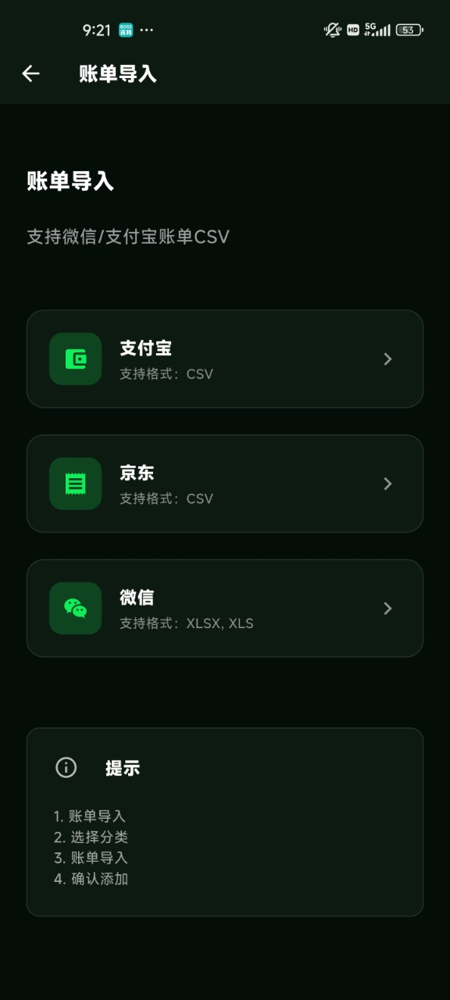

# 玺记（Xiji）家庭记账本 - Flutter 开源记账应用

[](https://flutter.dev)
[](https://dart.dev)
[](LICENSE)
[](#快速开始)

**Xiji** is an open-source **family finance / expense tracker / bookkeeping** app built with Flutter.

**玺记（Xiji）** 是一款开源家庭记账 / 家庭账本应用。Flutter 跨平台客户端配合 Spring Boot 后端，一家人可以共同记账，支持语音记账、微信 / 支付宝 / 京东账单导入、统计与月度预算。

## 界面预览

首页 · 记一笔 · 统计 · 家庭邀请 · 账单导入

<p>
  
  
  
  
  
</p>

## 功能

- **用户认证**：手机号登录、注册、忘记密码
- **手动记账**：支出 / 收入、分类、日期、备注
- **语音记账**：设备端语音识别，由后端解析生成账单
- **账单导入**：微信（xlsx/xls）、支付宝（csv）、京东（csv），异步解析后确认入库
- **家庭协作**：注册时自动创建家庭；邀请二维码、扫码申请、管理员审核、成员管理、退出家庭；加入多个家庭后可切换
- **统计分析**：周 / 月 / 年，支持分类、趋势、成员、日期
- **日历**：按日期查看账单
- **月度预算**：设置并查看执行进度
- **分类管理**：查看与维护收支分类
- **个性化**：多主题、简体 / 繁体 / 英文、字号

本仓库是客户端。服务端接口、账单解析、短信与对象存储见后端仓库。

## 相关仓库

GitHub 为源仓库；Gitee 为同步镜像，内容以 GitHub 为准。

| 端 | GitHub（源仓库） | Gitee（同步镜像） |
| --- | --- | --- |
| 前端（本仓库） | [liberty-ask/xiji_flutter](https://github.com/liberty-ask/xiji_flutter) | [liberty-warehouse/xiji_flutter](https://gitee.com/liberty-warehouse/xiji_flutter) |
| 后端 Spring Boot | [liberty-ask/xiji](https://github.com/liberty-ask/xiji) | [liberty-warehouse/xiji](https://gitee.com/liberty-warehouse/xiji) |

## 技术栈

| 技术 | 版本 | 用途 |
| --- | --- | --- |
| Flutter / Dart | 3.x | 跨平台 UI |
| Provider | ^6.1.1 | 状态管理 |
| GoRouter | ^13.0.0 | 路由 |
| Dio | ^5.4.0 | HTTP |
| SharedPreferences | ^2.2.2 | 本地偏好 |
| Flutter Secure Storage | ^9.0.0 | Token 等敏感信息 |
| fl_chart | ^0.65.0 | 统计图表 |
| speech_to_text | ^7.3.0 | 语音识别 |
| qr_flutter / mobile_scanner | ^4.1.0 / ^5.2.3 | 邀请码生成与扫码 |
| file_picker / image_picker | ^8.1.2 / ^1.0.7 | 账单文件与图片选择 |
| intl / flutter_localizations | — | 简体、繁体、英文 |

本地不使用 SQLite。账单数据走后端 API。

## 快速开始

### 环境

- Flutter SDK 3.x（Dart 3）
- Android Studio 或 VS Code
- 本机调试需同时启动后端，默认 API 为 `http://127.0.0.1:8089/api`

### 安装与运行

```bash
git clone https://github.com/liberty-ask/xiji_flutter.git
cd xiji_flutter
flutter pub get
flutter devices
flutter run
```

Web：

```bash
flutter run -d chrome
```

### 配置 API 地址

地址在 [`lib/services/api/api_client.dart`](lib/services/api/api_client.dart) 中按编译模式切换：

- **Debug**（`kDebugMode == true`）：`http://127.0.0.1:8089/api`
- **Release**：同一文件中的正式环境地址，按你的后端部署修改

真机调试时，把 `127.0.0.1` 改成电脑局域网 IP，并保证手机与后端同一网络。

### 构建

```bash
flutter build apk
flutter build appbundle
flutter build ios      # 需要 macOS
flutter build web
```

## 许可证

[MIT License](LICENSE)。可商用、可修改、可再分发，需保留版权与许可声明。

## 贡献

请在 GitHub 源仓库参与： [liberty-ask/xiji_flutter](https://github.com/liberty-ask/xiji_flutter)

1. Fork GitHub 仓库
2. 新建分支（例如 `feat/xxx` 或 `fix/xxx`）
3. 提交变更并向 GitHub 发起 Pull Request

---

**玺记** — 温馨家庭，共同记账
